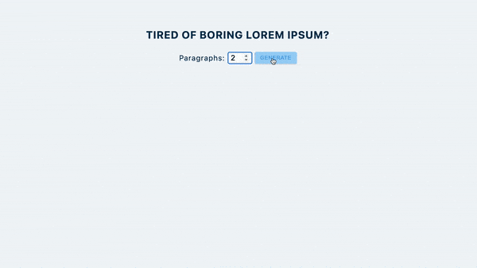

## Summary

Generate lorem ipsum paragraphs by entering the input number.

[Live Demo](https://christy313.github.io/react15-project08)



Idea: [Hipster Ipsum](https://hipsum.co/)

## File structure

```
.
├── README.md
└── src
    ├── App.js
    ├── data.js
    ├── index.css
    └── index.js
```

## Available Scripts

In the project directory, you can run:

### `npm start`

Runs the app in the development mode.\
Open [http://localhost:3000](http://localhost:3000) to view it in your browser.
